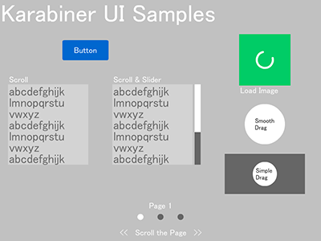

# Karabiner
Karabiner is UI library for as3.

[demo](./bin/index.html)



This library provides the basic UI components.
(Button, ImageLoader, DraggableObject, Scroll and Slider, ScrollPage and Indicator) 
These can be implemented with a few code.

The library does not have the view element.
It takes the layout movie clip from the SWC, and wraps using the component class.
This allows you to customize the view element.

All of the component object inherits from "Karabiner.FrameworkObjectBase",
it is initialized by being "addChild ()" to the stage.
Is destructor processing by being similarly "removeChild ()".

## Require

- [ImageLoadQue](http://www.libspark.org/wiki/ImageLoadQueue)

## Usage

`./src/Main.as` and `./gui/GUI.fla`.

#### Button

./src/SampleButton.as

```
var btn:SampleButton = new SampleButton();
btn.WrapFromSWC(view.getChildByName("sample_button"));
```

#### ImageLoader

```
var image:ImageObject = new ImageObject("http://PATH/TO/IMAGE.png", null, false);
image.SetPostLoadSizing(100, 100);
image.LoadImage();
```

#### DraggableObject

```
var drag:SimpleDraggableObject = new SimpleDraggableObject();
drag.WrapFromSWC(view.getChildByName("sample_simple_draggable"));
```

```
var drag:DraggableObject = new DraggableObject(new Rectangle(0, 0, stageWidth, stageHeight));
drag.WrapFromSWC(view.getChildByName("sample_smooth_draggable"));
drag.DragStart();
```

#### Scroll and Slider

```
var container:VirticalScrollContainer =
	new VirticalScrollContainer(view.getChildByName("sample_scroll_mask_1").getRect(view));
container.WrapFromSWC(view.getChildByName("sample_scroll_text_1"));
container.InitDrag();
```

```
var slider:SliderObject = new SliderObject(DRAG_DIRECTION.VIRTICAL);
slider.WrapFromSWC(view.getChildByName("sample_slider"));

slider.addEventListener(SliderEvent.CHANGE_SLIDER_VALUE, function(e:Event):void {
	container.SetScroll(slider.SliderValue, slider.height);
});
slider.SetThumbSize(masked_area.height / scroll_text.height);
slider.InitDrag();
```

#### ScrollPage and Indicator

```
var pageList:ScrollPageList = new ScrollPageList(pages, pages[0].width);
view.addChild(pageList);

var pageIngicator:PageIndicator = new PageIndicator(pageList, pages.length, 50, IngicatorBtnView);
view.addChild(pageIngicator);
```