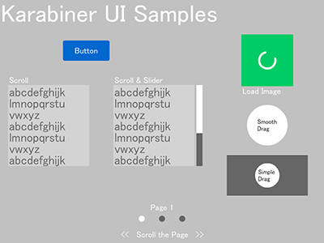

# Karabiner
Karabiner is UI library for as3.

[demo](https://dl.dropboxusercontent.com/u/4733593/Karabiner/index.html)



このライブラリは基本的なUIコンポーネントを提供し、数行のコードで実装可能です。
(ボタン, 画像, ドラッグ可能なオブジェクト, スクロールとスライダー, スクロールするページとインジケータ など) 

このライブラリ自体は View 要素を持っていません。
Flash IDE を使ってレイアウトされた MovieClip を SWC ライブラリとして用意し、 各コンポーネントクラスでラップして利用します。
これにより自由な表示のカスタマイズが可能です。

全てのコンポーネントは　`Karabiner.FrameworkObjectBase`　を継承しています。
それは内部的に `addChild()` でステージに追加された時に初期化イベントが実行され、
同様に `removeChild()` でステージから取り除かれた時にデストラクタイベントが実行されます。

また、すぐにプロジェクトを開始したい場合は [Backpack](https://github.com/sharkattack51/Backpack) を利用できます。

## Require

- [ImageLoadQue](http://www.libspark.org/wiki/ImageLoadQueue)

## Usage

`./src/Main.as` and `./gui/GUI.fla`.

#### Button

./src/SampleButton.as

```
var btn:SampleButton = new SampleButton();
btn.WrapFromSWC(view.getChildByName("sample_button"));
```

#### ImageLoader

```
var image:ImageObject = new ImageObject("http://PATH/TO/IMAGE.png", null, false);
image.SetPostLoadSizing(100, 100);
image.LoadImage();
```

#### DraggableObject

```
var drag:SimpleDraggableObject = new SimpleDraggableObject();
drag.WrapFromSWC(view.getChildByName("sample_simple_draggable"));
```

```
var drag:DraggableObject = new DraggableObject(new Rectangle(0, 0, stageWidth, stageHeight));
drag.WrapFromSWC(view.getChildByName("sample_smooth_draggable"));
drag.DragStart();
```

#### Scroll and Slider

```
var container:VirticalScrollContainer =
	new VirticalScrollContainer(view.getChildByName("sample_scroll_mask_1").getRect(view));
container.WrapFromSWC(view.getChildByName("sample_scroll_text_1"));
container.InitDrag();
```

```
var slider:SliderObject = new SliderObject(DRAG_DIRECTION.VIRTICAL);
slider.WrapFromSWC(view.getChildByName("sample_slider"));

slider.addEventListener(SliderEvent.CHANGE_SLIDER_VALUE, function(e:Event):void {
	container.SetScroll(slider.SliderValue, slider.height);
});
slider.SetThumbSize(masked_area.height / scroll_text.height);
slider.InitDrag();
```

#### ScrollPage and Indicator

```
var pageList:ScrollPageList = new ScrollPageList(pages, pages[0].width);
view.addChild(pageList);

var pageIngicator:PageIndicator = new PageIndicator(pageList, pages.length, 50, IngicatorBtnView);
view.addChild(pageIngicator);
```
